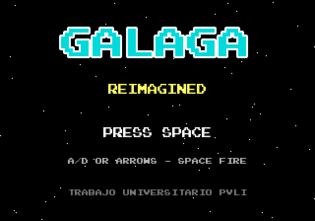
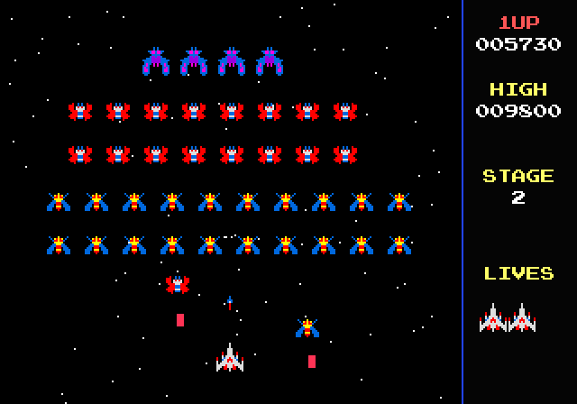

# Galaga Reimagined

> **Trabajo universitario** desarrollado para la asignatura de PVLI como proyecto individual de convocatoria extraordinaria.  
> El juego es una reinterpretación académica de la lógica arcade de *Galaga* implementada en **Phaser 3**.

## Enlaces

- **Repositorio de GitHub:** `https://github.com/theligero/Galaga`
- **Versión pública en GitHub Pages:** `https://theligero.github.io/Galaga/`

## Descripción general

**Galaga Reimagined** es un juego arcade de disparos de pantalla fija. El jugador controla una nave situada en la parte inferior del área de juego y debe destruir oleadas de enemigos alienígenas que entran en formación, se colocan en una parrilla superior y realizan ataques en picado hacia el jugador.

El objetivo principal es sobrevivir el mayor tiempo posible, superar fases y conseguir la puntuación más alta. El proyecto busca reproducir elementos reconocibles de *Galaga*: formación de enemigos, ataques descendentes, disparo limitado, sistema de puntuación, vidas, HUD lateral, pantalla de inicio, introducción de fase y pantalla de Game Over.

## Capturas del juego

### Menú principal



### Partida



## Controles

- **Mover nave:** flechas izquierda/derecha o teclas `A` / `D`.
- **Disparar:** `Espacio`.
- **Empezar partida:** `Espacio`, `Enter` o clic.
- **Volver al menú desde Game Over:** cualquier tecla o clic.

## Estructura del repositorio

```txt
index.html
README.md
GDD.md
architecture.md
assets.md
/css
/lib
/src
/assets
  /fonts
  /sounds
  /sprites
  /screenshots
/types
```

## Documentación

- [GDD.md](GDD.md): documento de diseño del juego.
- [architecture.md](architecture.md): arquitectura técnica, diagrama de escenas, clases y flujo de juego.
- [assets.md](assets.md): dirección artística, listado de recursos y procedencia.

## Tecnologías usadas

- **JavaScript ES Modules**
- **Phaser 3**
- **Arcade Physics**
- **Tweens**
- **Time Events**
- **Object pooling mediante grupos de Phaser**

## Estado del proyecto

El proyecto incluye actualmente:

- Menú inicial con estética arcade.
- Precarga de sprites, audio y fuente.
- Escena jugable con HUD lateral.
- Nave del jugador con movimiento horizontal y disparo limitado.
- Formación de enemigos.
- Entrada animada de enemigos a la formación.
- Ataques en picado.
- Disparos enemigos.
- Sistema de vidas, puntuación y récord local.
- Pantalla de Game Over.
- Avance de fase al eliminar todos los enemigos.

## Autoría

- **Autor:** Ignacio Ligero Martín
- **Estudio:** Estudio Individual PVLI
- **Asignatura:** PVLI
- **Tipo de entrega:** Proyecto individual

## Redes sociales

No se han creado redes sociales específicas para este proyecto.

## Créditos

Proyecto académico inspirado en el arcade original *Galaga* de Namco.  
Los recursos usados se documentan en [assets.md](assets.md).  
Este proyecto no es una versión comercial ni oficial de *Galaga*.
