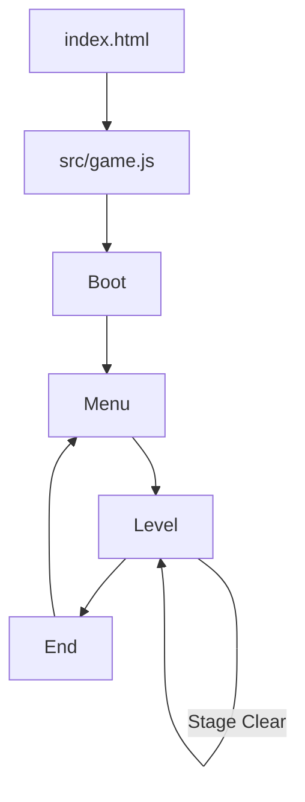
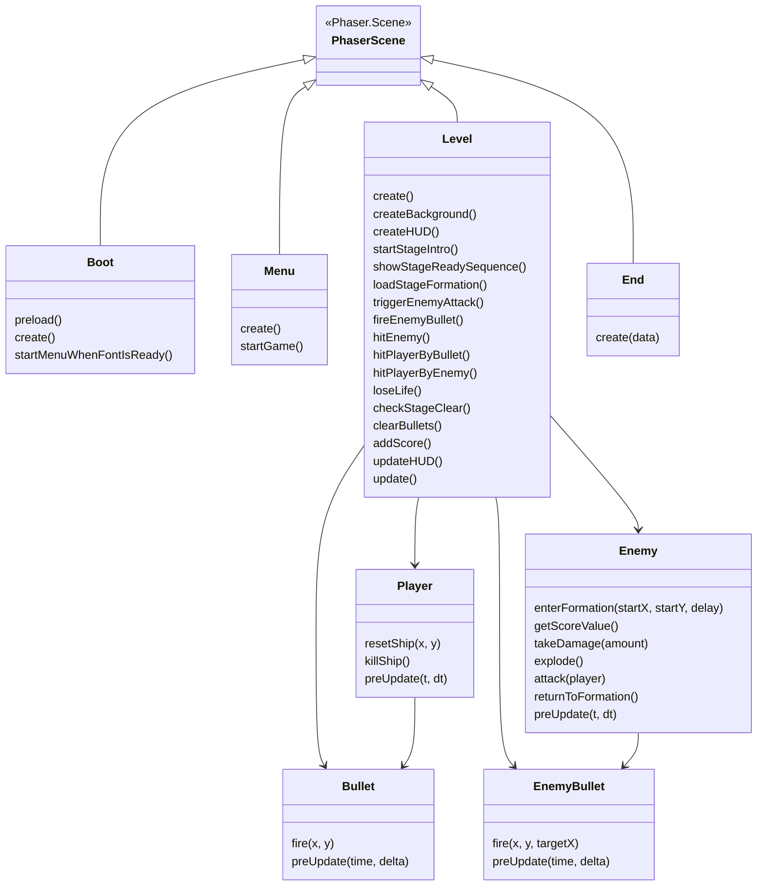
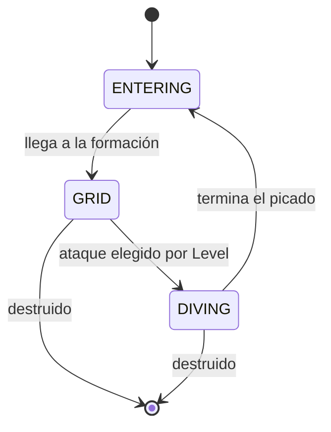
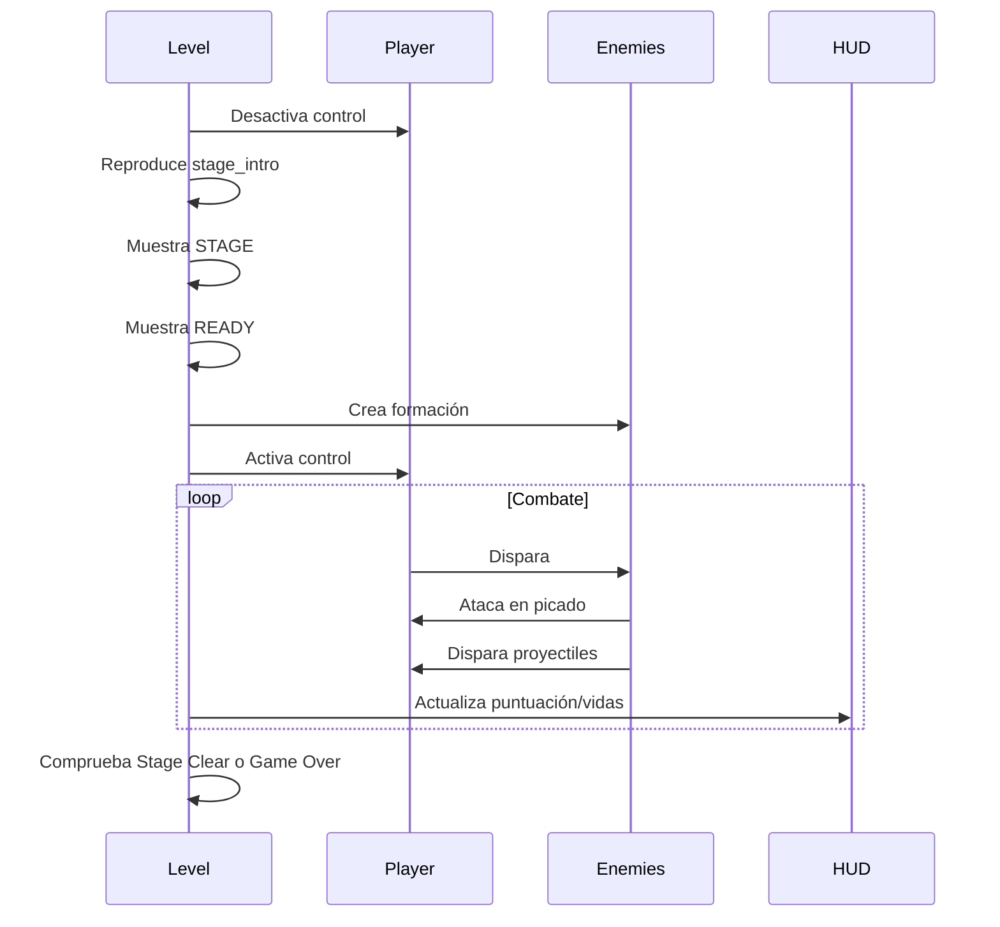

# Architecture - Galaga Reimagined

## 1. Visión general

El proyecto está implementado en **Phaser 3** usando JavaScript con módulos ES6. La arquitectura se organiza alrededor del sistema de escenas de Phaser y de varias clases de objetos de juego reutilizables.

El objetivo de esta arquitectura es separar:

- La carga inicial de recursos.
- El menú.
- La lógica jugable.
- La pantalla final.
- Las entidades principales: jugador, enemigos y proyectiles.

## 2. Estructura de carpetas

```txt
index.html
css/
  game.css
lib/
  phaser.js
src/
  game.js
  boot.js
  menu.js
  level.js
  end.js
  player.js
  enemy.js
  bullet.js
  enemyBullet.js
assets/
  fonts/
  sounds/
  sprites/
  screenshots/
types/
  phaser.d.ts
```

## 3. Configuración principal

El punto de entrada del juego es `src/game.js`.

```js
scene: [Boot, Menu, Level, End]
```

Este archivo crea la instancia de `Phaser.Game` y define:

- Tamaño de pantalla: `320x224`.
- Área jugable: `256x224`.
- HUD lateral: `64x224`.
- Renderizado con `pixelArt: true`.
- Física Arcade.

## 4. Diagrama de escenas



## 5. Responsabilidad de cada escena

| Escena | Archivo | Responsabilidad |
| --- | --- | --- |
| Boot | `boot.js` | Precargar sprites, sonidos y animaciones. Esperar a que la fuente arcade esté cargada antes de pasar al menú. |
| Menu | `menu.js` | Mostrar pantalla inicial, título, controles básicos y detectar inicio de partida. |
| Level | `level.js` | Controlar la partida: HUD, oleadas, enemigos, jugador, colisiones, puntuación, vidas, fases y respawn. |
| End | `end.js` | Mostrar Game Over, puntuación final, récord y permitir volver al menú. |

## 6. Diagrama de clases principales



## 7. Flujo de inicialización

1. `index.html` carga `phaser.js` y `src/game.js`.
2. `game.js` crea la instancia de Phaser.
3. `Boot` precarga:
   - Sprites.
   - Spritesheets.
   - Sonidos.
   - Animaciones.
4. `Boot` espera a que la fuente `arcade.ttf` esté disponible.
5. Se inicia `Menu`.
6. Al pulsar `Space`, `Enter` o hacer clic, se inicia `Level`.

## 8. Arquitectura de la escena jugable

`Level` actúa como coordinador principal de la partida.

Sus responsabilidades son:

- Crear el fondo estrellado.
- Crear el HUD lateral.
- Crear grupos de proyectiles.
- Crear al jugador.
- Crear el grupo de enemigos.
- Registrar colisiones.
- Controlar temporizadores de ataque.
- Gestionar la intro de fase.
- Gestionar puntuación, vidas y récord.

## 9. Distribución de pantalla

La pantalla se divide en dos áreas:

```txt
+-------------------------------+--------+
|                               | HUD    |
|        Área de juego          |        |
|        256 x 224              | 64 px  |
|                               |        |
+-------------------------------+--------+
```

- `PLAYFIELD_WIDTH = 256`
- `HUD_WIDTH = 64`
- Resolución total: `320x224`

La física del mundo se limita al área jugable para que el jugador no pueda entrar en el HUD:

```js
this.physics.world.setBounds(0, 0, this.PLAYFIELD_WIDTH, this.game.config.height);
```

## 10. Gestión de entidades

### 10.1. Jugador

La clase `Player` hereda de `Phaser.GameObjects.Sprite`.

Responsabilidades:

- Leer input.
- Moverse en horizontal.
- Disparar.
- Activarse/desactivarse durante muerte y respawn.

El jugador no controla la puntuación ni las vidas. Esa responsabilidad pertenece a `Level`.

### 10.2. Enemigos

La clase `Enemy` hereda de `Phaser.Physics.Arcade.Sprite`.

Cada enemigo almacena:

- Tipo de enemigo.
- Vida máxima.
- Vida actual.
- Posición de formación.
- Estado actual.
- Parámetros de ataque en picado.

Estados del enemigo:



### 10.3. Proyectiles

Hay dos clases separadas:

- `Bullet`: proyectil del jugador.
- `EnemyBullet`: proyectil enemigo.

Ambas se gestionan mediante grupos de Phaser. Cuando un proyectil sale de pantalla o colisiona, se desactiva con `disableBody(true, true)` para evitar que siga colisionando de forma invisible.

## 11. Object pooling

Los proyectiles se crean con grupos limitados:

```js
this.bullets = this.physics.add.group({
  classType: Bullet,
  maxSize: 2,
  runChildUpdate: true
});

this.enemyBullets = this.physics.add.group({
  classType: EnemyBullet,
  maxSize: 8,
  runChildUpdate: true
});
```

Esto evita crear objetos nuevos en cada disparo. En su lugar, Phaser reutiliza instancias desactivadas.

## 12. Colisiones

Las colisiones principales se declaran en `Level.create()`:

```js
this.physics.add.overlap(this.bullets, this.enemies, this.hitEnemy, null, this);
this.physics.add.overlap(this.enemyBullets, this.player, this.hitPlayerByBullet, null, this);
this.physics.add.overlap(this.enemies, this.player, this.hitPlayerByEnemy, null, this);
```

### 12.1. Bala del jugador contra enemigo

1. Se desactiva la bala.
2. El enemigo recibe daño.
3. Si muere:
   - Se reproduce explosión.
   - Se suma puntuación.
   - Se comprueba si la fase está limpia.

### 12.2. Bala enemiga contra jugador

1. Se desactiva la bala.
2. Se llama a `loseLife()`.
3. Se limpia el resto de proyectiles.
4. Se reproduce la explosión del jugador.
5. Se muestra `READY`.
6. Se reactiva el jugador si quedan vidas.

### 12.3. Enemigo contra jugador

El callback comprueba cuál de los dos objetos es realmente el enemigo, porque en colisiones grupo-sprite el orden puede variar. Después destruye el enemigo y llama a `loseLife()`.

## 13. Temporizadores

El proyecto usa `this.time.addEvent()` y `this.time.delayedCall()` para:

- Retrasar el inicio de la fase.
- Esperar a que termine la música de introducción.
- Mostrar `STAGE` y `READY`.
- Lanzar ataques enemigos periódicos.
- Disparar balas enemigas durante el picado.
- Gestionar el respawn del jugador.

## 14. HUD

El HUD se dibuja dentro de `Level` mediante textos y sprites:

- `1UP`
- Puntuación actual
- `HIGH`
- Récord
- `STAGE`
- Número de fase
- Iconos de vidas

La puntuación se formatea con seis dígitos:

```js
String(value).padStart(6, '0')
```

El récord se guarda con `localStorage`.

## 15. Flujo de una fase



## 16. Decisiones de diseño técnico

### 16.1. `Level` como coordinador

Se centraliza la lógica de partida en `Level` porque es la escena que conoce todos los sistemas: jugador, enemigos, balas, HUD, puntuación y temporizadores.

### 16.2. Entidades separadas

`Player`, `Enemy`, `Bullet` y `EnemyBullet` tienen clases propias para evitar que `Level` contenga todo el comportamiento interno de cada entidad.

### 16.3. Estados simples para enemigos

Se usa una máquina de estados sencilla mediante strings (`ENTERING`, `GRID`, `DIVING`) para mantener el comportamiento comprensible y fácil de extender.

### 16.4. Separación entre área jugable y HUD

La anchura total del juego es mayor que la zona física para permitir un HUD lateral sin interferir con las colisiones.

## 17. Posibles extensiones

- Definir oleadas en JSON.
- Añadir trayectorias más complejas con curvas.
- Implementar captura de la nave del jugador.
- Añadir más fases y patrones.
- Crear una tabla de récords.
- Separar el HUD en una clase propia si el proyecto creciera.
